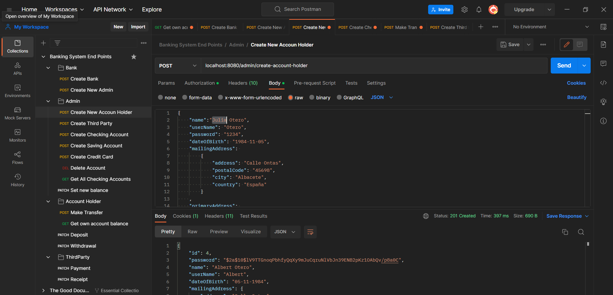
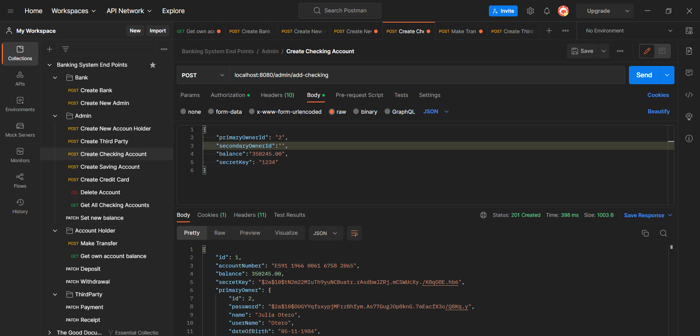
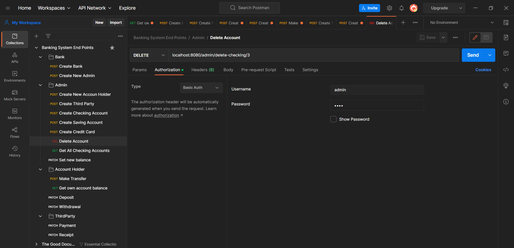
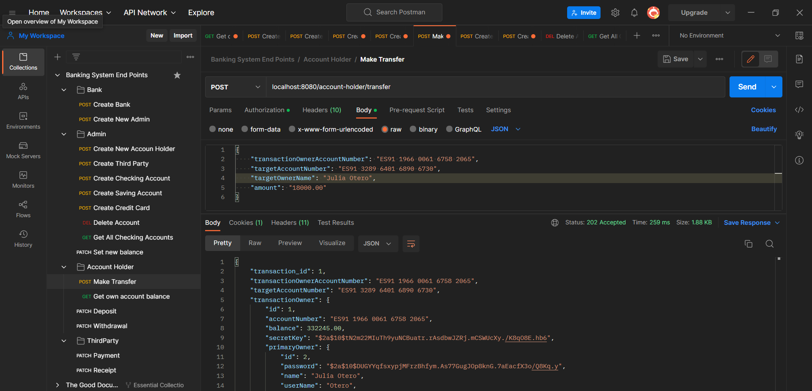
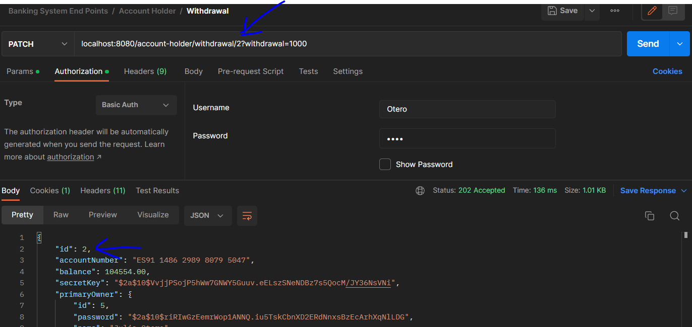
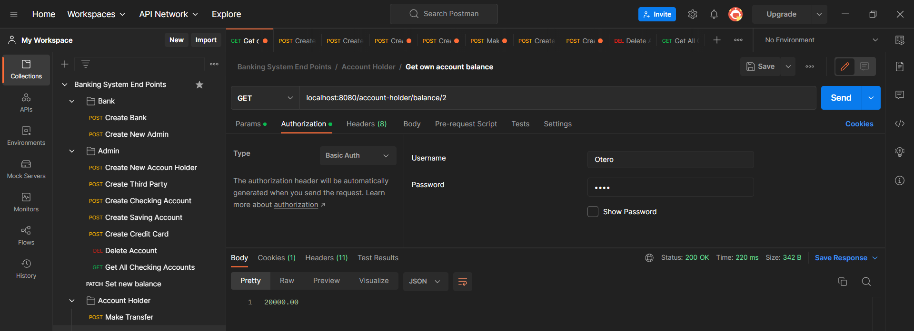

# Banking System 


# Spring boot REST API
Final bootcamp project demonstrating the use of Java and Spring-boot to build a microservice to be used by an online bank.

Technologies and dependencies

- Java 19
- Spring Boot
- Maven
- MySQL Driver
- Spring Data JPA
- Spring Web
- Spring Boot DevTools
- Spring Security
- Project lombok
- SQL

The system has 4 types of accounts, StudentChecking, Checking, Savings, and CreditCard. The system must have 3 types of Users: Admins, AccountHolders and ThirdParty.
Admins can create new accounts. When creating a new account they can create Checking, Savings or CreditCard Accounts.


## Running locally 
```
localhost:8080/
```
Remember to change the password in application.properties.
Some sample screenshots are available to help you test the api in Postman.

The database is included in the "dataBase" folder of the project under the name "banksystem".

For convenience it includes some examples of accounts and users ready for testing.

Routes are secured, passwords are encrypted when creating Accounts and Users. Remember them to be able to authorise requests in Postman.

## Testing
Import the "postman end points collection" file into the application. They are in the project folder.

### How to test
1. Create Bank
   > Use create account API to create an account by providing a `name` and `userName`
   >
   


2. Create admin account
   >The admin account will allow you to create accounts as well as users. Remember their password :)
   > 
   

2. Create new account holder
   >Fill in the requested fields to create a new account holder. Remember that each account has a Primary Owner and an optional SecondaryOwner.

   

3. Choose an account type and fill in the details. Account numbers are created randomly when an account is initiated and are unique.
   >If your account holder is under 24 years of age, the system will automatically open a "Student Checking" account for you under different conditions.

   

4. Delete Account
   >Try the route to delete accounts

   

5. Make a transaction
   >Make sure to replace the account numbers with two that are created in the database together. Enter the credentials that allow the transaction.

   

4. Withdraw
   >Remember to select the id that corresponds to the correct user account in the request header.

   

5. Check Balance again to verify withdrawal
   >Verify the transaction through the corresponding route

   


### Author
<li><a href="https://github.com/RobertoVetere">Roberto Vetere</a></li>
