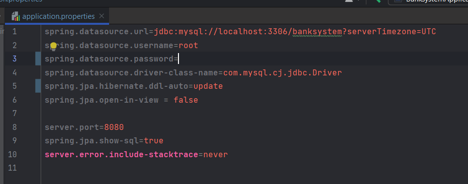
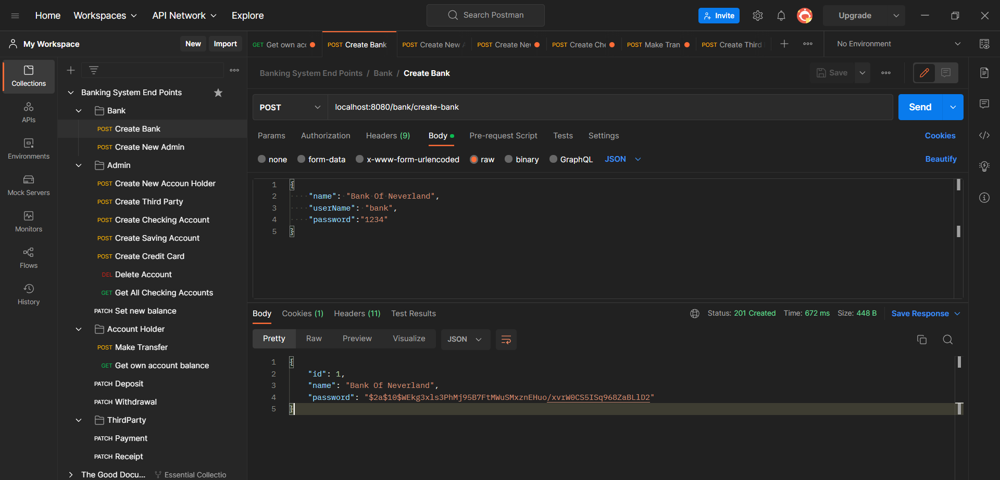
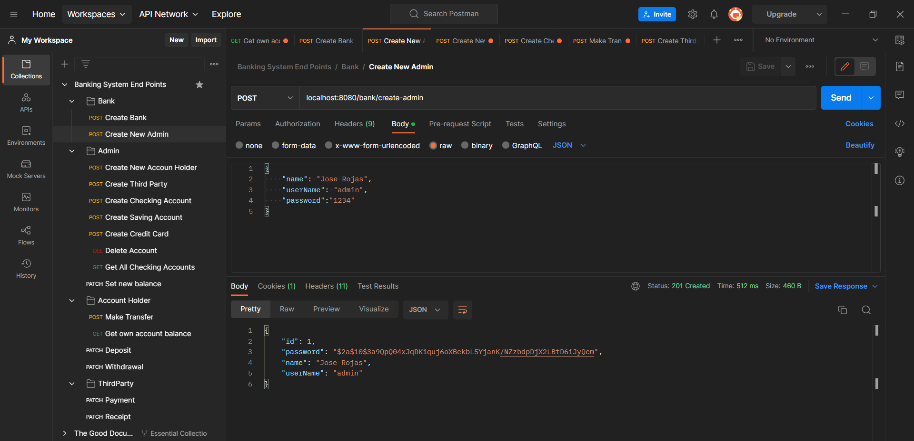

# Banking System 


# Spring boot REST API
Example project demonstrating the use of Java and Spring-boot to build a microservice to be used by an online bank

## Running locally 
```
localhost:8080/
```
Remember to change the password in application.properties



The database is included in the "dataBase" folder of the project under the name "banksystem".
For convenience it includes some examples of accounts and users ready for testing.

## Testing
Import the "postman end points collection" file into the application.

### How to test
1. Create Bank
   > Use create account API to create an account by providing a `bankName` and `ownerName`
   >
   

> Make sure to write down the `sortCode` and the `accountNumber` to proceed with other APIs

2. Create admin account
   

2. Create new account holder
   >Use noted `accountNumber` as `targetAccountNo` and provide amount greater than zero to deposit cash into an account

   

3. Check Balance
   >Use noted `accountNumber` and `sortCode` to check account balance

   

4. Withdraw Cash
   >Use noted `accountNumber` and `sortCode` and `amount` grater than zero to withdraw cash from an account

   

5. Check Balance again to verify withdrawal

   


### Extensions
1. Use of persisted database
2. Use of asynchronous programming backed by message queue for transactions
3. Others mentioned throughout the code
